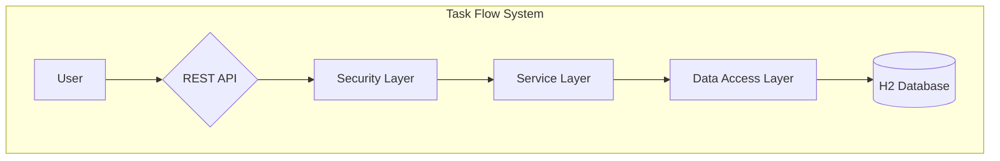
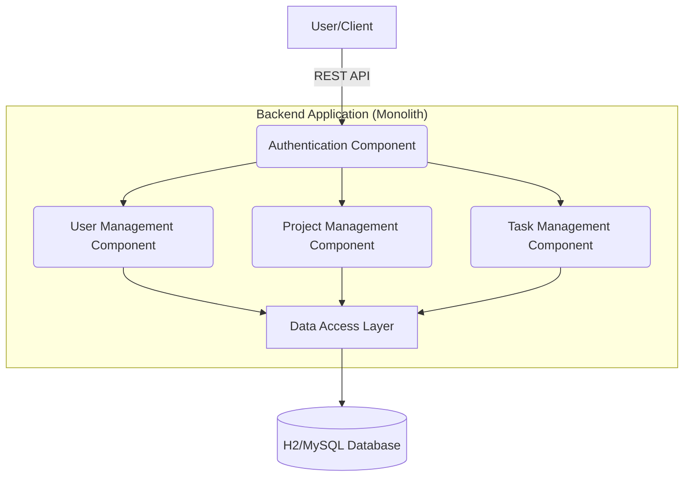
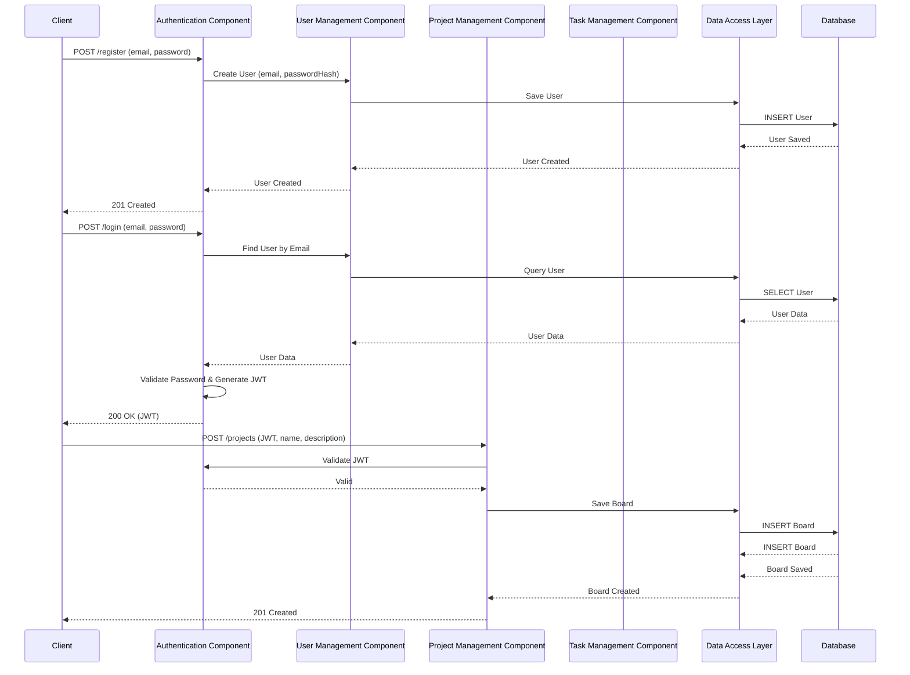
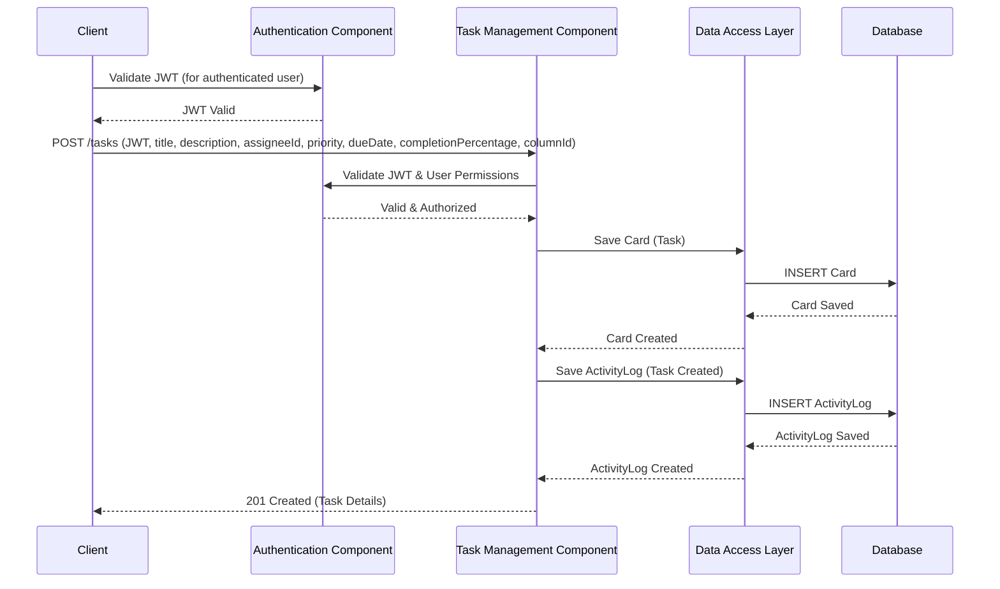

# Task Flow Project Architecture Document

## 1. Introduction

This document outlines the overall project architecture for Task Flow Project, including backend systems, shared services, and non-UI specific concerns. Its primary goal is to serve as the guiding architectural blueprint for AI-driven development, ensuring consistency and adherence to chosen patterns and technologies.

**Relationship to Frontend Architecture:**
If the project includes a significant user interface, a separate Frontend Architecture Document will detail the frontend-specific design and MUST be used in conjunction with this document. Core technology stack choices documented herein (see "Tech Stack") are definitive for the entire project, including any frontend components.

### 1.1. Starter Template or Existing Project

Based on the PRD's "Technical Assumptions" section, there is no mention of a starter template or existing project. This is a greenfield project. We will proceed with architecture design from scratch, noting that manual setup will be required for all tooling and configuration.

### 1.2. Architectural Goals

-   **Speed of Development:** The architecture must facilitate rapid development to meet the two-day target for being "ready to start development." This implies choosing familiar technologies and straightforward patterns.
-   **Simplicity and Maintainability:** The system should be easy to understand, build upon, and maintain. A monolithic architecture, as specified in the PRD, supports this goal for the initial scope.
-   **Clear Separation of Concerns:** The architecture should enforce a logical separation between different parts of the application (e.g., authentication, project management, task management) to improve modularity.
-   **Security by Design:** Security is a core requirement. The architecture must incorporate security best practices from the ground up, particularly for authentication (JWT) and authorization (RBAC).
-   **Scalability (Future-Proofing):** While the initial version is a monolith, the design should not preclude future evolution. We should use patterns (like the Repository pattern) that would make it easier to scale or refactor parts of the system later if needed.

### 1.3. Change Log

| Date         | Version | Description        | Author            |
| :----------- | :------ | :----------------- | :---------------- |
| 2025-11-05   | 1.0     | Initial Draft      | Winston (Architect) |

---

## 2. High Level Architecture

### 2.1. Technical Summary
The architecture for the Task Flow Project will be a **Spring Boot-based monolith**. This approach is chosen to align with the primary goals of rapid development and simplicity for the initial MVP. The system will follow a traditional three-tier architecture (Presentation, Business Logic, Data Access) and will expose a RESTful API for consumption by a future web client. Key architectural patterns include the **Repository pattern** for data abstraction and **Dependency Injection** for loose coupling, ensuring a clean and maintainable codebase from the start.

### 2.2. High Level Overview
-   **Architectural Style:** Monolith. This is a pragmatic choice for a small team and a well-defined initial scope, minimizing operational complexity.
-   **Repository Structure:** Monorepo. A single repository will contain the entire backend codebase.
-   **User Interaction Flow:** Users will interact with the system via a REST API. The primary flow involves authentication (JWT), followed by operations on projects, tasks, and other resources.
-   **Key Decisions:**
    -   **Monolith over Microservices:** Chosen for simplicity and speed of development, which are critical for this project.
    -   **REST over GraphQL:** REST is a well-understood and straightforward choice for the defined requirements.

### 2.3. High Level Project Diagram


### 2.4. Architectural and Design Patterns
-   **Three-Tier Architecture:** A classic pattern that separates the application into a presentation layer (the REST API), a business logic layer (services), and a data access layer (repositories).
    -   *Rationale:* This provides a clear separation of concerns and is a well-established pattern in the Spring Boot ecosystem.
-   **Repository Pattern:** This pattern will be used to abstract the data access logic from the business logic.
    -   *Rationale:* It makes the application more testable and allows for easier migration to a different database in the future.
-   **Dependency Injection (DI):** Spring's built-in DI will be used to manage object creation and dependencies.
    -   *Rationale:* DI promotes loose coupling and makes the code more modular and easier to test.

---

## 3. Tech Stack

### 3.1. Cloud Infrastructure
-   **Provider:** Not Applicable for initial development. The application will be developed and run locally.
-   **Key Services:** N/A
-   **Deployment Regions:** N/A

### 3.2. Technology Stack Table

| Category         | Technology       | Version        | Purpose                                           | Rationale                                                               |
| :--------------- | :--------------- | :------------- | :------------------------------------------------ | :---------------------------------------------------------------------- |
| **Language**     | Java             | 21             | Primary backend development language              | User-specified; a modern, long-term support (LTS) version of Java.      |
| **Runtime**      | JDK              | 21             | Java Development Kit                              | Required to build and run the Java 21 application.                      |
| **Framework**    | Spring Boot      | 3.2.0          | Core backend framework                            | As per PRD; provides rapid development for REST APIs and web apps.      |
| **Build Tool**   | Maven            | 3.9.5          | Dependency management and project build           | A standard, widely-used build tool for Java projects.                   |
| **Database**     | H2 Database      | 2.2.224        | In-memory DB for **local dev & automated tests**    | As per PRD; enables rapid setup and clean test runs via `dev`/`test` profiles. |
| **Database**     | MySQL            | 8.0.33         | Relational DB for **production & staging**        | User-specified; a robust RDBMS for production-like environments via `prod` profile. |
| **Security**     | Spring Security  | 6.2.0          | Authentication and Authorization                  | As per PRD; the standard for securing Spring applications.              |
| **API Security** | JJWT (`io.jsonwebtoken`) | 0.12.3 | JSON Web Token (JWT) implementation               | As per PRD; a popular library for creating and parsing JWTs.            |
| **Testing**      | JUnit 5          | 5.10.0         | Unit and integration testing framework            | The standard testing framework for modern Java applications.            |
| **Testing**      | Mockito          | 5.7.0          | Mocking framework for tests                       | Allows for creating mock objects to isolate components during testing.  |
| **Frontend**     | React            | 18.2.0         | Frontend JavaScript library                       | User-specified; a popular library for building user interfaces.         |
| **Frontend**     | Vite             | 5.0.0          | Frontend build tool and development server        | User-specified; provides a fast and efficient development experience for React. |

---

## 4. Data Models

### 4.1. User

**Purpose:** Represents a user of the Task Flow system, capable of authentication and participation in projects.

**Key Attributes:**
- `id`: UUID - Unique identifier for the user.
- `email`: String (unique) - User's email address, used for login.
- `passwordHash`: String - Hashed password for secure authentication.
- `firstName`: String - User's first name.
- `lastName`: String - User's last name.
- `roles`: List<String> - Roles assigned to the user (e.g., "ADMIN", "USER").

**Relationships:**
- A User can be assigned to multiple Boards (Projects) with specific roles.
- A User can be an assignee for multiple Cards (Tasks).

### 4.2. Board (Project)

**Purpose:** Represents a project or a Kanban board, which is a container for columns and cards.

**Key Attributes:**
- `id`: UUID - Unique identifier for the board.
- `name`: String - Name of the project/board.
- `description`: String - Description of the project/board.
- `createdAt`: Instant - Timestamp when the board was created.
- `updatedAt`: Instant - Timestamp when the board was last updated.

**Relationships:**
- A Board has many Columns.
- A Board has many Cards (indirectly through Columns).
- A Board has many Users (team members) with associated roles.

### 4.3. ColumnType

**Purpose:** Defines the predefined types or statuses for columns within a board (e.g., "To Do", "In Progress", "Done").

**Key Attributes:**
- `id`: UUID - Unique identifier for the column type.
- `name`: String (unique) - Name of the column type (e.g., "Inicial", "Pendente", "Final", "Cancelamento").
- `order`: Integer - Display order of the column type.

**Relationships:**
- A ColumnType can be used by multiple Columns across different Boards.

### 4.4. Column

**Purpose:** Represents a specific column on a Board, holding a collection of Cards.

**Key Attributes:**
- `id`: UUID - Unique identifier for the column.
- `boardId`: UUID - Foreign key referencing the Board it belongs to.
- `columnTypeId`: UUID - Foreign key referencing the ColumnType that defines its status.
- `order`: Integer - Display order of the column within its board.

**Relationships:**
- A Column belongs to one Board.
- A Column has one ColumnType.
- A Column has many Cards.

### 4.5. Card (Task)

**Purpose:** Represents an individual task or work item within a Column on a Board.

**Key Attributes:**
- `id`: UUID - Unique identifier for the card.
- `columnId`: UUID - Foreign key referencing the Column it belongs to.
- `assigneeId`: UUID (nullable) - Foreign key referencing the User assigned to the card.
- `title`: String - Title of the task.
- `description`: String - Detailed description of the task.
- `priority`: Enum (e.g., LOW, MEDIUM, HIGH) - Priority level of the task.
- `dueDate`: LocalDate (nullable) - Due date for the task.
- `completionPercentage`: Integer (0-100) - Percentage of task completion.
- `createdAt`: Instant - Timestamp when the card was created.
- `updatedAt`: Instant - Timestamp when the card was last updated.

**Relationships:**
- A Card belongs to one Column.
- A Card can be assigned to one User.
- A Card has many Comments.
- A Card has many ActivityLog entries.

### 4.6. Comment

**Purpose:** Represents a comment made by a user on a specific task (Card).

**Key Attributes:**
- `id`: UUID - Unique identifier for the comment.
- `cardId`: UUID - Foreign key referencing the Card it belongs to.
- `userId`: UUID - Foreign key referencing the User who made the comment.
- `content`: String - The actual comment text.
- `createdAt`: Instant - Timestamp when the comment was created.

**Relationships:**
- A Comment belongs to one Card.
- A Comment is made by one User.

### 4.7. ActivityLog

**Purpose:** Records significant events and changes related to a Card (task).

**Key Attributes:**
- `id`: UUID - Unique identifier for the activity log entry.
- `cardId`: UUID - Foreign key referencing the Card it belongs to.
- `userId`: UUID (nullable) - Foreign key referencing the User who performed the action (if applicable).
- `eventType`: Enum (e.g., CARD_CREATED, STATUS_CHANGED, ASSIGNEE_CHANGED, COMMENT_ADDED) - Type of activity.
- `details`: String (JSON/Text) - Details of the change (e.g., "status changed from 'To Do' to 'In Progress'").
- `timestamp`: Instant - Timestamp of the activity.

**Relationships:**
- An ActivityLog entry belongs to one Card.
- An ActivityLog entry can be associated with one User.

### 4.8. BoardMember (Join Table for Board and User)

**Purpose:** Manages the many-to-many relationship between Users and Boards, including the user's role within that specific board.

**Key Attributes:**
- `boardId`: UUID - Foreign key referencing the Board.
- `userId`: UUID - Foreign key referencing the User.
- `role`: Enum (e.g., MANAGER, EDITOR, VIEWER) - The user's role within this specific board.
- `joinedAt`: Instant - Timestamp when the user joined the board.

**Relationships:**
- Links a User to a Board with a specific role.

---

## 5. Components

### 5.1. Authentication Component

**Responsibility:** Manages all aspects of user authentication, including registration, login, password hashing, and JSON Web Token (JWT) generation and validation.

**Key Interfaces:**
- `AuthService`: Provides methods for user registration and login.
- `JwtService`: Handles JWT creation, validation, and extraction of claims.

**Dependencies:** User Management Component (for user details), Spring Security.

**Technology Stack:** Spring Security, JJWT library.

### 5.2. User Management Component

**Responsibility:** Manages user-related operations such as retrieving user profiles, updating user details, and managing user roles.

**Key Interfaces:**
- `UserService`: Provides CRUD operations for User entities.
- `UserRepository`: Data access for User entities.

**Dependencies:** Data Access Layer (for User entity).

**Technology Stack:** Spring Data JPA, H2/MySQL.

### 5.3. Project Management Component

**Responsibility:** Manages the creation, retrieval, update, and deletion of Boards (Projects) and their associated members (BoardMember). It also handles inviting users to projects and assigning roles.

**Key Interfaces:**
- `BoardService`: Provides business logic for Board operations.
- `BoardRepository`: Data access for Board entities.
- `BoardMemberService`: Manages relationships between Boards and Users.

**Dependencies:** User Management Component, Data Access Layer (for Board, BoardMember entities).

**Technology Stack:** Spring Data JPA, H2/MySQL.

### 5.4. Task Management Component

**Responsibility:** Manages all operations related to Columns and Cards (Tasks), including creation, updates, status changes, assignments, comments, and activity logging.

**Key Interfaces:**
- `ColumnService`: Manages Column entities.
- `CardService`: Manages Card entities.
- `CommentService`: Manages Comment entities.
- `ActivityLogService`: Manages ActivityLog entities.
- `ColumnRepository`, `CardRepository`, `CommentRepository`, `ActivityLogRepository`: Data access for respective entities.

**Dependencies:** User Management Component (for assignees), Project Management Component (for board context), Data Access Layer (for Column, Card, Comment, ActivityLog entities).

**Technology Stack:** Spring Data JPA, H2/MySQL.

### 5.5. Common/Shared Component

**Responsibility:** Provides cross-cutting concerns and utilities used across multiple components, such as global exception handling, utility classes, and common configurations.

**Key Interfaces:**
- `GlobalExceptionHandler`: Centralized error handling.
- `AppConfig`: Application-wide configuration beans.

**Dependencies:** None (provides utilities to other components).

**Technology Stack:** Spring Framework.

### 5.6. Component Diagrams





---

## 6. External APIs

No external API integrations are required for the initial scope of the Task Flow Project.

---

## 7. Core Workflows

### 7.1. Create Task Workflow



---

## 8. REST API Spec

```yaml
openapi: 3.0.0
info:
  title: Task Flow Project API
  version: 1.0.0
  description: API for managing tasks, projects, and users in the Task Flow system.
servers:
  - url: http://localhost:8080/api
    description: Local Development Server
tags:
  - name: Authentication
    description: User registration and login operations
  - name: Projects
    description: Project (Board) management operations
paths:
  /auth/register:
    post:
      summary: Register a new user
      tags:
        - Authentication
      requestBody:
        required: true
        content:
          application/json:
            schema:
              $ref: '#/components/schemas/RegisterRequest'
      responses:
        '201':
          description: User registered successfully
          content:
            application/json:
              schema:
                $ref: '#/components/schemas/User'
        '400':
          description: Invalid input
          content:
            application/json:
              schema:
                $ref: '#/components/schemas/ErrorResponse'
  /auth/login:
    post:
      summary: Authenticate user and get JWT
      tags:
        - Authentication
      requestBody:
        required: true
        content:
          application/json:
            schema:
              $ref: '#/components/schemas/LoginRequest'
      responses:
        '200':
          description: User authenticated, JWT returned
          content:
            application/json:
              schema:
                $ref: '#/components/schemas/LoginResponse'
        '401':
          description: Invalid credentials
          content:
            application/json:
              schema:
                $ref: '#/components/schemas/ErrorResponse'
  /projects:
    post:
      summary: Create a new project (board)
      tags:
        - Projects
      security:
        - bearerAuth: []
      requestBody:
        required: true
        content:
          application/json:
            schema:
              $ref: '#/components/schemas/CreateProjectRequest'
      responses:
        '201':
          description: Project created successfully
          content:
            application/json:
              schema:
                $ref: '#/components/schemas/Board'
        '400':
          description: Invalid input
          content:
            application/json:
              schema:
                $ref: '#/components/schemas/ErrorResponse'
        '401':
          description: Unauthorized
          content:
            application/json:
              schema:
                $ref: '#/components/schemas/ErrorResponse'
components:
  securitySchemes:
    bearerAuth:
      type: http
      scheme: bearer
      bearerFormat: JWT
  schemas:
    RegisterRequest:
      type: object
      required:
        - email
        - password
        - firstName
        - lastName
      properties:
        email:
          type: string
          format: email
          example: user@example.com
        password:
          type: string
          format: password
          minLength: 8
          example: securepassword123
        firstName:
          type: string
          example: John
        lastName:
          type: string
          example: Doe
    LoginRequest:
      type: object
      required:
        - email
        - password
      properties:
        email:
          type: string
          format: email
          example: user@example.com
        password:
          type: string
          format: password
          example: securepassword123
    LoginResponse:
      type: object
      properties:
        token:
          type: string
          description: JWT token for authentication
          example: eyJhbGciOiJIUzI1NiIsInR5cCI6IkpXVCJ9...
        user:
          $ref: '#/components/schemas/User'
    User:
      type: object
      properties:
        id:
          type: string
          format: uuid
          example: 123e4567-e89b-12d3-a456-426614174000
        email:
          type: string
          format: email
          example: user@example.com
        firstName:
          type: string
          example: John
        lastName:
          type: string
          example: Doe
        roles:
          type: array
          items:
            type: string
          example: ["USER", "MANAGER"]
    CreateProjectRequest:
      type: object
      required:
        - name
        - description
      properties:
        name:
          type: string
          example: My First Project
        description:
          type: string
          example: A project to manage my personal tasks.
    Board:
      type: object
      properties:
        id:
          type: string
          format: uuid
          example: 123e4567-e89b-12d3-a456-426614174001
        name:
          type: string
          example: My First Project
        description:
          type: string
          example: A project to manage my personal tasks.
        createdAt:
          type: string
          format: date-time
          example: '2025-11-05T10:00:00Z'
        updatedAt:
          type: string
          format: date-time
          example: '2025-11-05T10:00:00Z'
    ErrorResponse:
      type: object
      properties:
        timestamp:
          type: string
          format: date-time
          example: '2025-11-05T10:00:00Z'
        status:
          type: integer
          example: 400
        error:
          type: string
          example: Bad Request
        message:
          type: string
          example: Validation failed for argument [0] in public...
        path:
          type: string
          example: /api/auth/register
```

---

## 9. Database Schema

This section outlines the SQL Data Definition Language (DDL) for the core entities. This schema is designed to be compatible with both H2 (for development and testing) and MySQL (for production and staging environments).

**Note on UUIDs:** For MySQL, UUIDs will typically be stored as `BINARY(16)` for efficiency, while H2 can handle `VARCHAR(36)` or `BINARY(16)`. Spring Data JPA will handle the mapping.

**Note on Enums:** Enums will be mapped to `VARCHAR` columns in the database, storing their string representation.

```sql
-- Table: users
CREATE TABLE users (
    id BINARY(16) PRIMARY KEY,
    email VARCHAR(255) NOT NULL UNIQUE,
    password_hash VARCHAR(255) NOT NULL,
    first_name VARCHAR(255),
    last_name VARCHAR(255),
    -- Roles will likely be managed through a separate join table or embedded in a JSON column for simplicity in a monolith
    -- For now, we'll assume a simple string representation or a separate roles table if needed later.
    -- For initial implementation, a simple string or a many-to-many with a 'roles' table is common.
    -- Let's assume a simple string for now, and refine if RBAC complexity increases.
    -- For Spring Security, roles are often fetched from a separate table or a simple string.
    -- Let's add a simple roles column for now, which can be a comma-separated string or JSON.
    roles VARCHAR(255) DEFAULT 'USER' -- Example: "USER,MANAGER"
);

-- Table: boards (Projects)
CREATE TABLE boards (
    id BINARY(16) PRIMARY KEY,
    name VARCHAR(255) NOT NULL,
    description TEXT,
    created_at DATETIME NOT NULL,
    updated_at DATETIME NOT NULL
);

-- Table: column_types
CREATE TABLE column_types (
    id BINARY(16) PRIMARY KEY,
    name VARCHAR(255) NOT NULL UNIQUE,
    display_order INT NOT NULL
);

-- Table: columns
CREATE TABLE columns (
    id BINARY(16) PRIMARY KEY,
    board_id BINARY(16) NOT NULL,
    column_type_id BINARY(16) NOT NULL,
    display_order INT NOT NULL,
    FOREIGN KEY (board_id) REFERENCES boards(id) ON DELETE CASCADE,
    FOREIGN KEY (column_type_id) REFERENCES column_types(id) ON DELETE RESTRICT
);

-- Table: cards (Tasks)
CREATE TABLE cards (
    id BINARY(16) PRIMARY KEY,
    column_id BINARY(16) NOT NULL,
    assignee_id BINARY(16),
    title VARCHAR(255) NOT NULL,
    description TEXT,
    priority VARCHAR(50) NOT NULL, -- Enum: LOW, MEDIUM, HIGH
    due_date DATE,
    completion_percentage INT DEFAULT 0,
    created_at DATETIME NOT NULL,
    updated_at DATETIME NOT NULL,
    FOREIGN KEY (column_id) REFERENCES columns(id) ON DELETE CASCADE,
    FOREIGN KEY (assignee_id) REFERENCES users(id) ON DELETE SET NULL
);

-- Table: comments
CREATE TABLE comments (
    id BINARY(16) PRIMARY KEY,
    card_id BINARY(16) NOT NULL,
    user_id BINARY(16) NOT NULL,
    content TEXT NOT NULL,
    created_at DATETIME NOT NULL,
    FOREIGN KEY (card_id) REFERENCES cards(id) ON DELETE CASCADE,
    FOREIGN KEY (user_id) REFERENCES users(id) ON DELETE CASCADE
);

-- Table: activity_logs
CREATE TABLE activity_logs (
    id BINARY(16) PRIMARY KEY,
    card_id BINARY(16) NOT NULL,
    user_id BINARY(16), -- Can be null if system action
    event_type VARCHAR(100) NOT NULL, -- Enum: CARD_CREATED, STATUS_CHANGED, ASSIGNEE_CHANGED, COMMENT_ADDED
    details TEXT, -- JSON or descriptive text
    timestamp DATETIME NOT NULL,
    FOREIGN KEY (card_id) REFERENCES cards(id) ON DELETE CASCADE,
    FOREIGN KEY (user_id) REFERENCES users(id) ON DELETE SET NULL
);

-- Table: board_members (Join table for users and boards with roles)
CREATE TABLE board_members (
    board_id BINARY(16) NOT NULL,
    user_id BINARY(16) NOT NULL,
    role VARCHAR(50) NOT NULL, -- Enum: MANAGER, EDITOR, VIEWER
    joined_at DATETIME NOT NULL,
    PRIMARY KEY (board_id, user_id),
    FOREIGN KEY (board_id) REFERENCES boards(id) ON DELETE CASCADE,
    FOREIGN KEY (user_id) REFERENCES users(id) ON DELETE CASCADE
);

-- Indexes for performance
CREATE INDEX idx_users_email ON users(email);
CREATE INDEX idx_boards_name ON boards(name);
CREATE INDEX idx_columns_board_id ON columns(board_id);
CREATE INDEX idx_cards_column_id ON cards(column_id);
CREATE INDEX idx_cards_assignee_id ON cards(assignee_id);
CREATE INDEX idx_comments_card_id ON comments(card_id);
CREATE INDEX idx_activity_logs_card_id ON activity_logs(card_id);
CREATE INDEX idx_board_members_user_id ON board_members(user_id);
```

---

## 10. Source Tree

The project will adopt a monorepo structure, containing both the backend (Spring Boot) and frontend (React/Vite) applications within a single repository. This promotes easier development and deployment for a monolithic application.

```plaintext
simple-todo/
├── .bmad-core/                 # BMAD core files (existing)
├── .gemini/                    # Gemini agent configuration (existing)
├── docs/                       # Project documentation (PRD, Architecture, etc.)
│   ├── architecture.md         # This Architecture Document
│   ├── brainstorming-session-results.md
│   └── prd.md                  # Product Requirements Document
├── backend/                    # Spring Boot Backend Application
│   ├── src/
│   │   ├── main/
│   │   │   ├── java/
│   │   │   │   └── com/
│   │   │   │       └── grupo5/
│   │   │   │           └── taskflow/
│   │   │   │               ├── config/             # Spring Security, JWT, Database config
│   │   │   │               ├── controller/         # REST API Endpoints (Auth, Project, Task)
│   │   │   │               ├── dto/                # Data Transfer Objects (Request/Response)
│   │   │   │               ├── exception/          # Custom Exception classes
│   │   │   │               ├── model/              # JPA Entities (User, Board, Card, etc.)
│   │   │   │               ├── repository/         # Spring Data JPA Repositories
│   │   │   │               ├── security/           # JWT filters, UserDetailsService
│   │   │   │               └── service/            # Business Logic (Auth, User, Project, Task)
│   │   │   └── resources/
│   │   │       ├── application.properties      # Main application configuration
│   │   │       ├── application-dev.properties  # H2 specific configuration
│   │   │       └── application-prod.properties # MySQL specific configuration
│   │   └── test/
│   │       └── java/
│   │           └── com/
│   │               └── grupo5/
│   │                   └── taskflow/
│   │                       ├── controller/         # Controller tests
│   │                       ├── repository/         # Repository tests
│   │                       └── service/            # Service tests
│   └── pom.xml                 # Maven build file for the backend
├── frontend/                   # React/Vite Frontend Application
│   ├── public/                 # Static assets
│   ├── src/
│   │   ├── assets/             # Images, icons, etc.
│   │   ├── components/         # Reusable React components
│   │   ├── hooks/              # Custom React hooks
│   │   ├── pages/              # Top-level page components (Login, Dashboard, ProjectBoard)
│   │   ├── services/           # API client for backend communication
│   │   ├── utils/              # Utility functions
│   │   ├── App.jsx             # Main application component
│   │   └── main.jsx            # Entry point for React application
│   ├── index.html              # Main HTML file
│   ├── package.json            # npm/yarn dependencies for the frontend
│   ├── vite.config.js          # Vite configuration
│   └── .env                    # Environment variables
├── .gitignore                  # Git ignore rules
├── README.md                   # Project README
└── package.json                # Root package.json (for monorepo scripts, if any)
```

---

## 11. Infrastructure and Deployment

### 11.1. Infrastructure as Code

-   **Tool:** Terraform (for cloud resources)
-   **Location:** `infrastructure/terraform/` (a new directory at the root level)
-   **Approach:** Declarative infrastructure definition for cloud resources.

### 11.2. Deployment Strategy

-   **Strategy:** Blue/Green Deployment (for production environments)
-   **CI/CD Platform:** GitHub Actions (for automated builds, tests, and deployments)
-   **Pipeline Configuration:** `.github/workflows/` (a new directory at the root level for CI/CD pipeline definitions)

### 11.3. Environments

-   **Development (Local):** Developers run the Spring Boot backend with H2 and the React/Vite frontend locally.
-   **Staging:** A pre-production environment mirroring production, using MySQL, for integration testing and stakeholder review.
-   **Production:** The live environment serving end-users, using MySQL.

### 11.4. Environment Promotion Flow

```text
Development (Local)
    ↓
Staging (Automated Deployment via GitHub Actions on merge to 'develop' branch)
    ↓
Production (Manual Approval, then Automated Blue/Green Deployment via GitHub Actions on merge to 'main' branch)
```

### 11.5. Rollback Strategy

-   **Primary Method:** Revert to the previous stable version.
-   **Trigger Conditions:** Critical bugs, performance degradation, or security vulnerabilities detected post-deployment.
-   **Recovery Time Objective:** Aim for a Recovery Time Objective (RTO) of less than 15 minutes for critical issues.

---

## 12. Error Handling Strategy

### 12.1. General Approach

-   **Error Model:** Centralized exception handling using Spring's `@ControllerAdvice` and `@ExceptionHandler` to provide consistent error responses.
-   **Exception Hierarchy:** Custom exception classes will be defined for specific business logic errors (e.g., `ResourceNotFoundException`, `InvalidInputException`), extending common Spring exceptions or `RuntimeException`.
-   **Error Propagation:** Exceptions will be propagated up the call stack until caught by the global exception handler, which will translate them into appropriate HTTP status codes and a standardized error response body.

### 12.2. Logging Standards

-   **Library:** SLF4J with Logback (default for Spring Boot)
-   **Format:** JSON format for structured logging, facilitating easier parsing and analysis by logging tools.
-   **Levels:**
    -   `ERROR`: For critical issues that prevent functionality or indicate system failure.
    -   `WARN`: For potentially problematic situations that don't immediately stop functionality.
    -   `INFO`: For significant events in the application lifecycle (e.g., request received, major process completed).
    -   `DEBUG`: For detailed information useful for debugging during development.
    -   `TRACE`: For very fine-grained information, typically used for deep debugging.
-   **Required Context:**
    -   **Correlation ID:** A unique ID generated per request, propagated across all logs for that request to trace its flow.
    -   **Service Context:** Application name, component name (e.g., `AuthService`, `UserController`).
    -   **User Context:** User ID (if authenticated) to link actions to specific users.

### 12.3. Error Handling Patterns

#### 12.3.1. External API Errors

-   **Retry Policy:** Implement a retry mechanism (e.g., using Spring Retry) with exponential backoff for transient external API failures.
-   **Circuit Breaker:** Implement a circuit breaker pattern (e.g., using Resilience4j) to prevent cascading failures when an external service is unresponsive.
-   **Timeout Configuration:** Configure explicit timeouts for all external API calls to prevent indefinite waiting.
-   **Error Translation:** Translate external API errors into internal custom exceptions or standardized error responses to avoid exposing third-party error details.

#### 12.3.2. Business Logic Errors

-   **Custom Exceptions:** Use specific custom exceptions (e.g., `UserAlreadyExistsException`, `ProjectNotFoundException`) to clearly indicate business rule violations.
-   **User-Facing Errors:** Ensure error messages returned to the client are user-friendly, informative, and do not expose sensitive internal details.
-   **Error Codes:** Implement a system of internal error codes to provide more granular information for debugging and client-side handling.

#### 12.3.3. Data Consistency

-   **Transaction Strategy:** Use Spring's `@Transactional` annotation to ensure atomicity for database operations, rolling back changes if an error occurs.
-   **Compensation Logic:** For complex, multi-step operations that span multiple services or external systems, consider implementing compensation logic (e.g., Saga pattern) to undo previous actions in case of failure.
-   **Idempotency:** Design API endpoints and operations to be idempotent where possible, allowing safe retries without unintended side effects.

---

## 13. Coding Standards

These coding standards are MANDATORY for all developers, including AI agents, to ensure consistency, maintainability, and adherence to project-specific conventions. We assume general best practices for Java and Spring Boot are known; this section focuses on project-specific rules and critical guidelines.

### 13.1. Core Standards

-   **Languages & Runtimes:**
    -   Backend: Java 21, JDK 21
    -   Frontend: JavaScript (ESNext), React 18.2.0, Node.js (LTS version compatible with Vite)
-   **Style & Linting:**
    -   Backend: Follow Google Java Format (or equivalent standard formatter) and adhere to SonarQube/Checkstyle rules (if integrated).
    -   Frontend: Use ESLint with React recommended rules and Prettier for code formatting.
-   **Test Organization:**
    -   Backend: Tests should reside in `src/test/java` mirroring the main package structure.
    -   Frontend: Tests should be co-located with the component they test (e.g., `Component.test.jsx`) or in a dedicated `__tests__` directory within the component's folder.

### 13.2. Naming Conventions

-   **Java Classes/Interfaces:** PascalCase (e.g., `UserService`, `TaskController`).
-   **Java Methods/Variables:** camelCase (e.g., `getUserById`, `firstName`).
-   **Java Constants:** SCREAMING_SNAKE_CASE (e.g., `DEFAULT_PAGE_SIZE`).
-   **REST Endpoints:** kebab-case for paths (e.g., `/api/task-flow`).
-   **Database Tables:** snake_case, plural (e.g., `users`, `board_members`).
-   **Database Columns:** snake_case (e.g., `first_name`, `created_at`).

### 13.3. Critical Rules

-   **Logging:** Never use `System.out.println()` or `e.printStackTrace()` in backend code. Always use the configured SLF4J logger.
-   **Security:**
    -   Never hardcode secrets (API keys, passwords, etc.) in the codebase. Use Spring Boot's externalized configuration or a secrets management service.
    -   All API endpoints that modify data or access sensitive information MUST be secured with JWT authentication and appropriate role-based authorization.
-   **Database Access:** All database interactions in the backend MUST go through the Repository pattern (Spring Data JPA interfaces). Direct `EntityManager` usage should be avoided in services.
-   **DTO Usage:** All data exchanged via REST APIs (request bodies, response bodies) MUST use Data Transfer Objects (DTOs) to decouple API contracts from internal domain models.
-   **Frontend State Management:** Prefer React's built-in state management (useState, useContext) for local component state. For global state, consider a lightweight solution like Zustand or Jotai if needed, but avoid over-engineering.

### 13.4. Language-Specific Guidelines

#### 13.4.1. Java Specifics

-   **Immutability:** Prefer immutable objects where feasible, especially for DTOs and configuration classes.
-   **Optional Usage:** Use `Optional` for potentially null return values from repositories or services to improve null safety.
-   **Stream API:** Leverage Java Stream API for collection processing to write more concise and readable code.

#### 13.4.2. JavaScript/React Specifics

-   **Functional Components & Hooks:** Always use functional components and React Hooks for new development. Class components are deprecated.
-   **Prop Types/TypeScript:** Use PropTypes or TypeScript for component prop validation to improve component reusability and reduce bugs.
-   **Conditional Rendering:** Use short-circuiting (`&&`) or ternary operators (`? :`) for conditional rendering in JSX.

---

## 14. Test Strategy and Standards

This section outlines the comprehensive test strategy for the Task Flow Project, ensuring high quality and reliability across both backend and frontend components.

### 14.1. Testing Philosophy

-   **Approach:** A "test-after" approach will be adopted for initial development to prioritize rapid feature delivery, with a commitment to writing comprehensive tests immediately after feature implementation.
-   **Coverage Goals:**
    -   Backend: Aim for 80% line coverage for business logic services and controllers.
    -   Frontend: Aim for 70% component coverage for critical UI components and pages.
-   **Test Pyramid:** The testing effort will follow a test pyramid structure, with a large base of unit tests, a moderate layer of integration tests, and a small number of end-to-end (E2E) tests.

### 14.2. Test Types and Organization

#### 14.2.1. Unit Tests

-   **Framework (Backend):** JUnit 5
-   **Framework (Frontend):** Vitest (for Vite-based React projects)
-   **File Convention (Backend):** Test classes will be named `[ClassName]Test.java` (e.g., `UserServiceTest.java`).
-   **File Convention (Frontend):** Test files will be named `[ComponentName].test.jsx` or `[ComponentName].test.js`.
-   **Location (Backend):** `backend/src/test/java/com/grupo5/taskflow/` mirroring the main source package.
-   **Location (Frontend):** Co-located with the component they test (e.g., `frontend/src/components/Button/Button.test.jsx`).
-   **Mocking Library (Backend):** Mockito
-   **Coverage Requirement:** As per "Testing Philosophy" above.

**AI Agent Requirements:**
-   Generate tests for all public methods in services and controllers.
-   Cover edge cases and error conditions.
-   Follow AAA pattern (Arrange, Act, Assert) for test structure.
-   Mock all external dependencies (e.g., repositories, other services) in unit tests.

#### 14.2.2. Integration Tests

-   **Scope (Backend):** Test the interaction between multiple components (e.g., controller to service, service to repository, database interaction).
-   **Scope (Frontend):** Test the interaction between React components and the backend API (using mocked API responses).
-   **Location (Backend):** `backend/src/test/java/com/grupo5/taskflow/integration/`
-   **Location (Frontend):** `frontend/src/tests/integration/`
-   **Test Infrastructure (Backend):**
    -   **Database:** Testcontainers with MySQL for integration tests to ensure production parity. H2 will be used for faster unit tests.
    -   **Spring Boot Test:** Use `@SpringBootTest` with a test profile to load the full application context.
-   **Test Infrastructure (Frontend):**
    -   **API Mocking:** Mock Service Worker (MSW) or similar for mocking backend API calls.
    -   **React Testing Library:** For rendering and interacting with components in a browser-like environment.

#### 14.2.3. End-to-End (E2E) Tests

-   **Framework:** Playwright
-   **Scope:** Simulate real user journeys through the entire application (frontend to backend).
-   **Environment:** Dedicated staging environment.
-   **Test Data:** Use a clean, pre-seeded database in the staging environment for each E2E test run.

### 14.3. Test Data Management

-   **Strategy:**
    -   **Unit Tests:** Use in-memory data structures or simple mocks.
    -   **Integration Tests (Backend):** Use Testcontainers to spin up a fresh MySQL instance for each test run or test suite, ensuring isolation.
    -   **E2E Tests:** Use dedicated test data generation scripts or fixtures to populate the staging database before each test suite.
-   **Fixtures:** Backend test fixtures will be managed within test classes or dedicated utility classes. Frontend test data will be part of MSW handlers or mock data files.
-   **Cleanup:** Database cleanup will be handled automatically by Testcontainers for backend integration tests. E2E tests will rely on environment resets.

### 14.4. Continuous Testing

-   **CI Integration:** All unit and integration tests will be run automatically as part of the GitHub Actions CI pipeline on every push and pull request. E2E tests will run on merges to the `develop` and `main` branches.
-   **Performance Tests:** Basic load testing (e.g., using Apache JMeter or k6) will be considered for critical API endpoints in later stages.
-   **Security Tests:** Static Application Security Testing (SAST) tools will be integrated into the CI pipeline to scan for common vulnerabilities.

---

## 15. Security

This section defines MANDATORY security requirements and guidelines for all developers, including AI agents. Adherence to these rules is critical for building a secure Task Flow Project.

### 15.1. Input Validation

-   **Validation Library:** Spring Validation (JSR 380 Bean Validation) for backend, Formik/Yup or similar for frontend.
-   **Validation Location:**
    -   Backend: At the API boundary (controller layer) using `@Valid` annotations on DTOs.
    -   Frontend: Client-side validation for immediate user feedback, but always re-validate on the server.
-   **Required Rules:**
    -   All external inputs (request parameters, headers, body) MUST be validated.
    -   Whitelist approach (define what is allowed) preferred over blacklist (define what is forbidden).
    -   Sanitize all user-generated content to prevent XSS and injection attacks.

### 15.2. Authentication & Authorization

-   **Auth Method:** JWT-based authentication implemented with Spring Security.
-   **Session Management:** Stateless sessions managed by JWTs. No server-side session state.
-   **Required Patterns:**
    -   All protected API endpoints MUST require a valid JWT in the `Authorization: Bearer` header.
    -   Role-Based Access Control (RBAC) MUST be implemented using Spring Security's `@PreAuthorize` or method-level security annotations to enforce permissions based on user roles (ADMIN, MANAGER, EDITOR, VIEWER).
    -   Password hashing MUST use a strong, adaptive algorithm like BCrypt.

### 15.3. Secrets Management

-   **Development:** Environment variables (`.env` files for frontend, `application.properties` for backend) for local development.
-   **Production:** Dedicated secrets management service (e.g., HashiCorp Vault, AWS Secrets Manager, Azure Key Vault) for production environments.
-   **Code Requirements:**
    -   NEVER hardcode secrets directly in the codebase.
    -   Access secrets only via configuration services or environment variables.
    -   Ensure no secrets are logged or exposed in error messages.

### 15.4. API Security

-   **Rate Limiting:** Implement rate limiting (e.g., using Spring Cloud Gateway or a reverse proxy like Nginx) to protect against brute-force attacks and API abuse.
-   **CORS Policy:** Configure Cross-Origin Resource Sharing (CORS) policies to restrict API access to authorized frontend origins.
-   **Security Headers:** Implement standard security headers (e.g., HSTS, X-Content-Type-Options, X-Frame-Options) to mitigate common web vulnerabilities.
-   **HTTPS Enforcement:** All communication with the API MUST be over HTTPS.

### 15.5. Data Protection

-   **Encryption at Rest:** Database encryption (e.g., MySQL Transparent Data Encryption) for sensitive data at rest.
-   **Encryption in Transit:** All data in transit MUST be encrypted using TLS/SSL (HTTPS).
-   **PII Handling:** Personally Identifiable Information (PII) MUST be handled with extreme care, minimized, and encrypted where appropriate.
-   **Logging Restrictions:** Sensitive data (passwords, PII) MUST NOT be logged.

### 15.6. Dependency Security

-   **Scanning Tool:** Integrate dependency vulnerability scanning tools (e.g., OWASP Dependency-Check, Snyk) into the CI pipeline.
-   **Update Policy:** Regularly update dependencies to their latest stable versions to patch known vulnerabilities.
-   **Approval Process:** A formal review and approval process for introducing new third-party dependencies.

### 15.7. Security Testing

-   **SAST Tool:** Integrate Static Application Security Testing (SAST) tools (e.g., SonarQube, Checkmarx) into the CI pipeline for automated code analysis.
-   **DAST Tool:** Consider Dynamic Application Security Testing (DAST) tools (e.g., OWASP ZAP) for scanning running applications in staging environments.
-   **Penetration Testing:** Conduct periodic manual penetration testing by security experts for critical production releases.

---

## 16. Checklist Results Report

---

## 17. Next Steps

This document will now be used to guide the architecture and development phases. The next steps are:
1.  Review and approval of this Architecture Document by stakeholders.
2.  Begin story implementation with Dev agent
3.  Set up infrastructure with DevOps agent.
