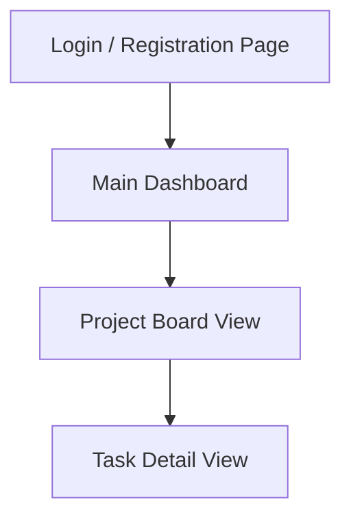

# Task Flow Project UI/UX Specification

## 1. Introduction

This document defines the user experience goals, information architecture, user flows, and visual design specifications for Task Flow Project's user interface. It serves as the foundation for visual design and frontend development, ensuring a cohesive and user-centered experience.

### 1.1. Overall UX Goals & Principles

**Target User Personas:**
*   **Project Managers:** Responsible for creating projects, defining scope, and managing teams.
*   **Collaborators (Team Members):** The primary users who create and manage tasks within projects.
*   **Administrators:** A system-level role for managing users and system-wide settings.

**Key Usability Goals:**
*   **Ease of learning:** New users can complete core tasks (e.g., creating a task, changing status) quickly.
*   **Efficiency of use:** Project Managers and Collaborators can manage tasks and projects with minimal friction.
*   **Error prevention:** Clear validation and confirmation for critical actions (e.g., deleting a project).
*   **Intuitive workflow:** The Kanban board interaction (drag and drop) should be natural and responsive.

**Core Design Principles:**
1.  **User-Centric:** Every design decision must serve user needs, focusing on making task management straightforward and efficient.
2.  **Simplicity:** Prioritize a clean and minimalist design to avoid cognitive overload.
3.  **Consistency:** Use familiar UI patterns and consistent visual language throughout the application.
4.  **Feedback:** Provide immediate and clear feedback for all user actions.
5.  **Accessibility:** Strive to meet WCAG 2.1 AA standards.

### 1.2. Change Log

| Date | Version | Description | Author |
| :----------- | :------ | :----------------- | :---------------- |
| 2025-11-05 | 1.0 | Initial Draft | Sally (UX Expert) |

## 2. Information Architecture (IA)

### 2.1. Site Map / Screen Inventory



### 2.2. Navigation Structure

**Primary Navigation:** A persistent global navigation (e.g., a sidebar or top bar) providing access to the Main Dashboard and potentially a "Create Project" action.

**Secondary Navigation:** Within a specific project, a secondary navigation might exist for project-specific settings or views (e.g., "Board Settings," "Team Members").

**Breadcrumb Strategy:** Breadcrumbs will be used to indicate the user's current location within a project hierarchy (e.g., `Dashboard > Project Name > Task Name`). This helps users understand their context and easily navigate back up the hierarchy.

## 3. User Flows

### 3.1. Create Task Workflow

**User Goal:** To create a new task within a project.

**Entry Points:**
*   From the Project Board View (e.g., a "Add Task" button within a column).
*   From a global "Create" action in the primary navigation.

**Success Criteria:**
*   A new task card is successfully created and displayed in the selected column on the Project Board.
*   All required task details (title, priority, etc.) are captured.
*   An activity log entry is recorded for the task creation.

### 3.1.1. Flow Diagram

```mermaid
graph TD
    A[User on Project Board] --> B{Click "Add Task" button}
    B --> C[Task Creation Form]
    C -- Fill details (title, assignee, priority, etc.) --> D{Click "Create Task"}
    D -- Validation successful --> E[Task Card added to Column]
    D -- Validation failed --> C
    E --> F[Activity Log Updated]
    F --> G[User sees new Task on Board]
```

### 3.1.2. Edge Cases & Error Handling:

-   **Missing Required Fields:** The form should provide clear inline validation messages for any missing required fields (e.g., task title).
-   **Invalid Input:** If an assignee ID is invalid or a due date is in the past, appropriate error messages should be displayed.
-   **Permissions Error:** If the user lacks the necessary permissions to create a task in a specific project or column, a clear error message should inform them of the restriction.
-   **Network Issues:** During form submission, if there are network connectivity problems, the system should provide feedback (e.g., a loading indicator, then an error message if the submission fails).
-   **System Error:** In case of an unexpected backend error, a generic, user-friendly error message should be displayed, and the error should be logged for developers.

### 3.1.3. Notes:

**Notes:** This workflow assumes that the user is already authenticated and has the necessary permissions to create tasks within the selected project and column. The task creation form should be designed to be intuitive, potentially using a modal or a dedicated page, and should provide a clear call to action for creating the task.

## 4. Wireframes & Mockups

### 4.1. Design Files

**Primary Design Files:** [Link to Figma/Sketch/Adobe XD Project]

### 4.2. Key Screen Layouts

### 4.2.1. Login / Registration Page

**Purpose:** To allow new users to register and existing users to log in to the Task Flow Project.

**Key Elements:**
-   Email input field
-   Password input field
-   "Login" button
-   "Register" button (or a toggle/link to switch between login and registration forms)
-   "Forgot Password" link
-   Optional: First Name and Last Name input fields for registration

**Interaction Notes:**
-   Form validation should provide immediate feedback for invalid inputs (e.g., invalid email format, password too short).
-   Successful login/registration should redirect the user to the Main Dashboard.
-   "Forgot Password" link should initiate a password recovery flow.

**Design File Reference:** [Link to specific frame in design tool]

### 4.2.2. Main Dashboard

**Purpose:** To provide an overview of the user's projects and quick access to their tasks.

**Key Elements:**
-   Header with application title and user profile/settings access
-   List/Grid of user's projects (boards), each showing:
    -   Project Name
    -   Brief description
    -   Number of active tasks (optional)
    -   Link to Project Board View
-   "Create New Project" button/action
-   Search/Filter functionality for projects (optional)

**Interaction Notes:**
-   Clicking on a project should navigate to its respective Project Board View.
-   The "Create New Project" action should open a form or modal for project creation.
-   User should be able to easily identify and access their active projects.

**Design File Reference:** [Link to specific frame in design tool]

### 4.2.3. Project Board View

**Purpose:** To display tasks within a project, organized by columns representing their status, and allow for task management via drag-and-drop.

**Key Elements:**
-   Project title and description
-   Columns representing task statuses (e.g., "To Do," "In Progress," "Done")
-   Task cards within each column, each showing:
    -   Task title
    -   Assignee (avatar/name)
    -   Priority indicator
    -   Due date (optional)
-   "Add Task" button/action within each column or a global "Add Task"
-   Drag-and-drop functionality for moving tasks between columns
-   Options for filtering/sorting tasks (optional)
-   Project settings/team management access

**Interaction Notes:**
-   Dragging a task card from one column to another should update its status.
-   Clicking on a task card should open the Task Detail View (modal or dedicated page).
-   "Add Task" action should open the task creation form.
-   The board should be responsive and adapt to different screen sizes.

**Design File Reference:** [Link to specific frame in design tool]

### 4.2.4. Task Detail View

**Purpose:** To display comprehensive details of a specific task, allow for editing, commenting, and viewing its activity log.

**Key Elements:**
-   Task title (editable)
-   Description (editable, rich text editor optional)
-   Assignee (editable, user selection dropdown)
-   Priority (editable, dropdown)
-   Due Date (editable, date picker)
-   Completion Percentage (editable, slider/input)
-   Comments section (with input for new comments and list of existing comments)
-   Activity Log (read-only list of task changes)
-   "Save" / "Cancel" buttons for edits
-   "Delete Task" action (with confirmation)

**Interaction Notes:**
-   All editable fields should allow for in-place editing or open a dedicated edit mode.
-   Adding a comment should immediately display the new comment in the list.
-   The activity log should be chronologically ordered.
-   Deleting a task should require a confirmation step to prevent accidental data loss.

**Design File Reference:** [Link to specific frame in design tool]

## 5. Component Library / Design System

### 5.1. Design System Approach

**Design System Approach:** Given the focus on a minimalist and clean design and no specific branding requirements, we will adopt a pragmatic approach. We will leverage a well-established, lightweight component library (e.g., a subset of Material UI, Ant Design, or Bootstrap components) for foundational elements, customizing it to fit our minimalist aesthetic. This allows for rapid development while maintaining consistency, without the overhead of building a full custom design system from scratch for the initial MVP.

### 5.2. Core Components

### 5.2.1. Button

**Purpose:** To trigger actions or navigate.

**Variants:** Primary, Secondary, Destructive, Ghost, Icon.

**States:** Default, Hover, Focus, Active, Disabled, Loading.

**Usage Guidelines:** Use clear, concise labels. Ensure sufficient contrast. Provide visual feedback for all states.

### 5.2.2. Input Field

**Purpose:** To allow users to enter text, numbers, or other data.

**Variants:** Text, Password, Email, Number, Textarea, Search.

**States:** Default, Focused, Hover, Disabled, Read-only, Error, Success.

**Usage Guidelines:** Provide clear labels and placeholder text. Implement inline validation feedback. Ensure sufficient padding and touch target size.

### 5.2.3. Dropdown/Select

**Purpose:** To allow users to choose from a predefined list of options.

**Variants:** Single-select, Multi-select.

**States:** Default, Open, Focused, Disabled, Error.

**Usage Guidelines:** Use when space is limited or when there are many options. Provide a clear label. Ensure options are easily scannable.

## 6. Branding & Style Guide

### 6.1. Visual Identity

**Brand Guidelines:** The visual identity will be minimalist and clean, prioritizing clarity and usability over elaborate branding. We will adhere to the principles of modern UI design, focusing on readability, intuitive layouts, and a subtle aesthetic that supports the task management workflow without distraction.

### 6.2. Color Palette

| Color Type | Hex Code | Usage |
| :--------- | :------- | :------------------------------------------ |
| Primary | `#4A90E2` | Main interactive elements, primary actions |
| Secondary | `#50E3C2` | Secondary actions, highlights |
| Accent | `#F5A623` | Important notifications, warnings |
| Success | `#7ED321` | Positive feedback, confirmations |
| Warning | `#F8E71C` | Cautions, important notices |
| Error | `#D0021B` | Errors, destructive actions |
| Neutral | `#333333` (Dark Gray), `#666666` (Medium Gray), `#999999` (Light Gray), `#E0E0E0` (Border/Divider), `#F5F5F5` (Background) | Text, borders, backgrounds |

### 6.3. Typography

**Font Families**
-   **Primary:** 'Roboto', sans-serif (for general UI text, headings)
-   **Secondary:** 'Open Sans', sans-serif (for longer body text, descriptions)
-   **Monospace:** 'Fira Code', monospace (for code snippets, technical information)

**Type Scale**

| Element | Size | Weight | Line Height |
| :------ | :--- | :----- | :---------- |
| H1 | 36px | 700 | 1.2 |
| H2 | 28px | 600 | 1.3 |
| H3 | 22px | 500 | 1.4 |
| Body | 16px | 400 | 1.5 |
| Small | 13px | 400 | 1.6 |

### 6.4. Iconography

**Icon Library:** Material Icons (from Google Fonts)

**Usage Guidelines:**
-   Use icons to visually reinforce meaning and improve scannability.
-   Ensure icons are clear, recognizable, and consistent in style.
-   Maintain a consistent size and color for icons within similar contexts.
-   Always pair icons with text labels when their meaning might be ambiguous.

### 6.5. Spacing & Layout

**Grid System:** A 12-column flexible grid system will be used for main page layouts, allowing for responsive design and consistent content alignment.

**Spacing Scale:** A base-8 pixel grid system will be applied for all spacing (margins, padding, gaps), ensuring vertical and horizontal rhythm and consistency across components. Key spacing values will be multiples of 8 (e.g., 8px, 16px, 24px, 32px).

## 7. Accessibility Requirements

### 7.1. Compliance Target

**Standard:** WCAG 2.1 AA

### 7.2. Key Requirements

**Visual:**
-   Color contrast ratios: All text and essential UI elements will meet a minimum contrast ratio of 4.5:1 (AA level) against their background.
-   Focus indicators: Clear and visible focus indicators will be provided for all interactive elements when navigated via keyboard.
-   Text sizing: Users will be able to resize text up to 200% without loss of content or functionality.

**Interaction:**
-   Keyboard navigation: All interactive elements will be fully navigable and operable using only a keyboard, following standard tab order.
-   Screen reader support: The UI will be designed with proper semantic HTML, ARIA attributes where necessary, and clear labels to ensure full compatibility with screen readers.
-   Touch targets: Interactive elements will have a minimum touch target size of 44x44 CSS pixels to accommodate users with motor impairments.

**Content:**
-   Alternative text: All meaningful images and non-text content will have appropriate alternative text descriptions.
-   Heading structure: A logical and hierarchical heading structure (H1, H2, H3, etc.) will be used to convey content organization.
-   Form labels: All form input fields will have clearly associated and visible labels.

### 7.3. Testing Strategy

**Accessibility Testing:** Accessibility testing will be integrated into the development lifecycle. This will include:
-   **Automated Tools:** Using tools like Lighthouse, Axe, or Wave for initial scans during development and in CI/CD pipelines.
-   **Manual Keyboard Testing:** Thoroughly testing all interactive elements using only a keyboard to ensure full navigability.
-   **Screen Reader Testing:** Conducting manual testing with common screen readers (e.g., NVDA, JAWS, VoiceOver) to verify content and interaction accessibility.
-   **Color Contrast Checkers:** Utilizing dedicated tools to verify color contrast ratios.
-   **User Testing:** Including users with disabilities in usability testing sessions where feasible.

## 8. Responsiveness Strategy

### 8.1. Breakpoints

| Breakpoint | Min Width | Max Width | Target Devices |
| :--------- | :-------- | :-------- | :------------- |
| Mobile | 0px | 767px | Smartphones (portrait and landscape) |
| Tablet | 768px | 1023px | Tablets (portrait and landscape) |
| Desktop | 1024px | 1439px | Laptops, standard desktop monitors |
| Wide | 1440px | - | Large desktop monitors, ultrawide displays |

### 8.2. Adaptation Patterns

**Layout Changes:**
-   **Mobile:** Single-column layouts, stacked elements, full-width components.
-   **Tablet:** Two-column layouts, flexible grids, optimized use of horizontal space.
-   **Desktop/Wide:** Multi-column layouts, fixed sidebars, complex data tables.

**Navigation Changes:**
-   **Mobile:** Off-canvas (hamburger menu) or bottom navigation bar.
-   **Tablet/Desktop:** Persistent sidebar or top navigation bar.

**Content Priority:**
-   **Mobile:** Prioritize essential information, hide secondary details behind toggles or accordions.
-   **Desktop:** Display more information upfront, leverage larger screen real estate.

**Interaction Changes:**
-   **Mobile:** Focus on touch-friendly gestures, larger touch targets.
-   **Desktop:** Support hover states, keyboard navigation, and precise mouse interactions.

## 9. Performance Considerations

### 9.1. Performance Goals

-   **Page Load:** Initial page load (First Contentful Paint) under 2 seconds on a fast 3G connection.
-   **Interaction Response:** UI interactions (e.g., button clicks, form submissions) should respond within 100ms to feel instantaneous.

### 9.2. Design Strategies

**Performance Strategies:**
-   **Lazy Loading:** Implement lazy loading for images, components, and data that are not immediately visible or critical for the initial view.
-   **Optimized Assets:** Use optimized image formats (e.P., WebP), compress assets, and serve appropriately sized images for different devices.
-   **Minimalist Design:** Adhere to the minimalist design principles to reduce visual clutter and the number of UI elements, which can impact rendering performance.
-   **Efficient Data Display:** Design data tables and lists to handle large datasets efficiently, potentially using virtualization or pagination.
-   **Progressive Enhancement:** Prioritize core functionality and content to load first, then progressively load enhanced features.
-   **Reduced DOM Complexity:** Strive for a lean and efficient DOM structure to minimize rendering time.

## 10. Next Steps

### 10.1. Immediate Actions

1.  Review and approval of this UI/UX Specification by stakeholders.
2.  Begin creating/updating detailed visual designs and prototypes in the chosen design tool (e.g., Figma).
3.  Prepare for handoff to the Design Architect for frontend architecture planning and technical implementation.
4.  Identify and address any open questions or decisions that emerged during the specification process.

### 10.2. Design Handoff Checklist

-   All user flows documented
-   Component inventory complete
-   Accessibility requirements defined
-   Responsive strategy clear
-   Brand guidelines incorporated
-   Performance goals established

## 11. Checklist Results

No formal UI/UX checklist was run against this document during its creation. This section is reserved for reporting the results of such a checklist if one is executed in the future.
